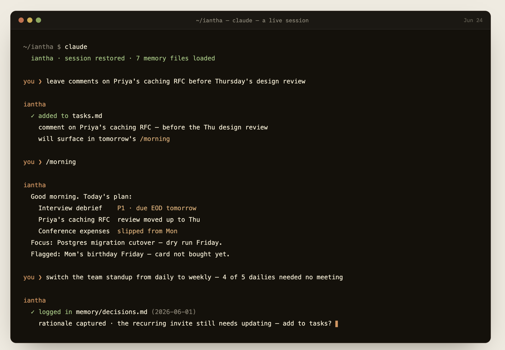

# Iantha

> Personal chief of staff + knowledge base curator, in markdown. A clone-and-run repo for Claude Code.

<p align="center">
  
</p>

Iantha is a memory + skills bundle that turns Claude Code into a personal assistant for daily life — tasks, reminders, decisions, routines, anything you'd otherwise keep in your head. Clone the repo, launch Claude Code inside it, and you have an assistant that remembers across sessions.

Optionally point Iantha at an Obsidian vault and it doubles as a knowledge-base curator — daily notes, decisions, weekly reviews, and a reading list, all in plain markdown. The pattern is inspired by Andrej Karpathy's [LLM Knowledge Bases](https://x.com/karpathy) framing: raw material lands in your vault, an LLM helps you compile it into something queryable, and you keep editing in your IDE of choice (Obsidian).

⭐ **Star this repo if you're running Iantha** — it helps others find it.

## Why

Claude Code remembers nothing between sessions. Mention "remind me Friday" or "I've decided to stop X" — next session starts blank. There's no structure for tasks, routines, or the life context you'd actually want an assistant to know.

Iantha is that structure: memory files auto-captured from chat, a `/setup` onboarding interview plus six daily-rhythm skills (`/morning`, `/evening`, `/debrief`, `/obsidian`, `/housekeep`, `/consolidate-learning`), and an optional Obsidian vault. The part you'd build yourself after a month of using Claude Code for life admin.

## Setup

Your memory is personal — tasks, people, routines — so it belongs in **your own private repo**, not a public fork. Two ways in:

**Use it for real (recommended).** Click **[Use this template](https://github.com/kiloloop/iantha/generate)** → create a **private** repo → clone it:

```bash
git clone https://github.com/<you>/<your-iantha>.git ~/iantha
cd ~/iantha
claude
```

Now `origin` is your private repo: commit your memory and it follows you across machines, private to you. (Want skill updates later? `git remote add upstream https://github.com/kiloloop/iantha.git` and merge when you like.)

**Just trying it.** A plain clone is fine for a test drive — but `origin` points at this public repo, which you can't push to, so re-point it at your own private repo before relying on cross-machine sync:

```bash
git clone https://github.com/kiloloop/iantha.git ~/iantha
cd ~/iantha
claude
```

Either way, Iantha reads `CLAUDE.md` and the `memory/` directory at session start. To make it yours in one sitting, type **`/setup`** — a short, skippable interview that seeds your memory with your real tasks, priorities, routines, and people, then runs `/morning` on it. Prefer to skip it? Just start talking — Iantha learns as you go, and `/setup` is re-runnable later to fill in the gaps.

> First setup: use the template, run `claude`, type `/setup` — a few minutes. Every day after: just `/morning`.

## What's Inside

```
.
├── CLAUDE.md              # Persona, rules, memory map
├── README.md              # You're reading it
├── config.yaml            # Optional vault config (vault_dir + subdirs)
├── .claude/skills/        # /setup, /morning, /evening, /debrief, /obsidian, /housekeep, /consolidate-learning
├── memory/                # Tasks, personal context, decisions, learnings
└── vault-template/        # Starter VAULT.md to copy into your Obsidian vault
```

## Daily Use

| Command | When | What it does |
|---------|------|--------------|
| `/setup` | first run (or to fill gaps) | Short onboarding interview — seeds your memory with your real life, then briefs you |
| `/morning` | start of day | Briefs you on today's tasks, priorities, anything overdue |
| `/evening` | end of day | Archives what got done, rolls recurring tasks, notes tomorrow |
| `/debrief` | end of substantive session | Captures decisions, learnings, feedback into memory |
| `/obsidian` | as needed | Vault read/write primitives (no-op without `vault_dir`) |
| `/housekeep` | weekly | Audits memory + skills + vault hygiene |
| `/consolidate-learning` | monthly | Promotes skill "Learned from runs" entries into main instructions |

Plus two more skills installed from [`kiloloop/oacp-skills`](https://oacp.dev/skills/) (see "Shared Skills" below) — `/self-improve`, `/wrap-up`.

Outside those, just talk to Iantha. Mention "tomorrow" or "by Friday" — it auto-captures. Share preferences or routines — it remembers. Ask for context — it surfaces what's relevant.

## Examples

These match the sample seeds the repo ships with (`memory/*.md.example`) — your first `/morning` on a fresh clone demos exactly this, labeled as sample data, while your real memory files start blank. The sample persona is a tech lead with a side project about to ship and a life around it — swap in your own.

**Auto-capture from chat.** Mention something time-bound in normal conversation and Iantha files it:

> **You:** I need to call mom tomorrow at 6pm.
>
> **Iantha:** Added to tasks — call Mom, tomorrow 18:00. I'll surface it in tomorrow's `/morning` briefing.

**Decision logging in passing.** Mention a decision and Iantha writes it to `memory/decisions.md` so it doesn't evaporate:

> **You:** I've decided to switch the team standup from daily to weekly. Signal-to-noise was too low.
>
> **Iantha:** Logged in `memory/decisions.md` with today's date, rationale captured. Want me to add updating the recurring invite to tasks?

## Memory

Iantha's persistent state is in `memory/`. The live files start **blank** and fill in as you use it; the `*.md.example` files carry **sample seeds** (same convention as `.env.example`) that power the first `/morning` demo — say *"delete the samples"* once you're running on your own data.

| File | Purpose |
|------|---------|
| `tasks.md` | All actionable items (urgent / work / personal / recurring / archive) |
| `personal.md` | About you — preferences, routines, people, life context |
| `priorities.md` | What you're focused on right now |
| `decisions.md` | Decisions you've made, with date and rationale |
| `feedback.md` | Corrections you've given Iantha (so it doesn't repeat mistakes) |
| `learnings.md` | Operational knowledge — tool gotchas, workflow insights |
| `MEMORY.md` | Thin index, loaded at session start |

The repo is git-tracked. Commit your memory updates and your context follows you across machines.

## Trust & Privacy

Iantha is files on your disk, nothing else.

- **Nothing leaves your machine** beyond your normal runtime traffic to its model provider (Claude Code → Anthropic, Codex → OpenAI) — no extra services, no telemetry, no third-party calls.
- **Memory is plain markdown.** Every fact Iantha knows about you is a diffable file in `memory/` you can read, edit, or delete — and `git log` is the audit trail of what changed and when.
- **No self-granted authority.** Memory is treated as executable policy: Iantha's rules forbid storing anything that would grant itself approval or identity shortcuts (the failure shape Anthropic documents in the Fable 5 system card, §2.3.3) — if such an entry ever appears, it gets flagged to you instead of followed.
- **The vault is optional and just as local.** Leave `vault_dir` unset and Iantha never touches Obsidian.

## Knowledge Base mode (optional)

Set `vault_dir` in `config.yaml` to point Iantha at an Obsidian vault. Then:

- `/morning` and `/evening` append to `${vault_dir}/daily/YYYY-MM-DD.md`
- `/obsidian decision` files decisions into `${vault_dir}/decisions/`
- `/obsidian reading-list` queues docs for your review
- `/obsidian lint` flags broken wikilinks, stale `_to-delete/` items, orphans

Run `/obsidian init` once to seed the vault with the standard directories and copy `vault-template/VAULT.md` into it. The handbook there is the contract Iantha follows when writing.

```yaml
# config.yaml
vault_dir: ~/Documents/MyVault
```

If `vault_dir` is unset, every vault hook no-ops silently — Iantha works fully without a vault.

## Shared Skills

Two skills come from [`kiloloop/oacp-skills`](https://github.com/kiloloop/oacp-skills) (catalog: <https://oacp.dev/skills/>) rather than being shipped in-repo. Install once with:

```bash
npx skills add kiloloop/oacp-skills self-improve wrap-up
```

You get:

- `/self-improve` — audit CLAUDE.md, skills, and memory for drift
- `/wrap-up` — end-of-session orchestrator (cleanup + debrief + self-improve + commit). Composes with the in-repo `/debrief`.

Optional, install per-need: `/doctor`, `/check-inbox`, `/review-loop-*`.

## Multi-runtime setup (optional)

If you run Iantha alongside other agents (Claude Code + Codex + Gemini, etc.) and want them to share session memory across runtimes, look at [`kiloloop/cortex`](https://github.com/kiloloop/cortex) — a cross-session memory layer (SSOT + debrief inbox) built on the [OACP](https://github.com/kiloloop/oacp) protocol. Cortex publishes its own `/debrief` and `/sync` skills wired to a shared inbox; Iantha's in-repo `/debrief` is the single-agent equivalent.

For solo personal use, you don't need cortex.

## Using with Codex / other runtimes

Iantha has no runtime lock-in — it **ships ready for both Claude Code and Codex** from the same clone. Nothing here is proprietary; the two runtimes just look in differently-named places, so the repo provides both, pointing at one set of files:

| | Claude Code reads | Codex reads | How it's shared |
|---|---|---|---|
| **Instructions** | `CLAUDE.md` | `AGENTS.md` | `AGENTS.md` is a symlink to `CLAUDE.md` |
| **Skills** | `.claude/skills/` | `.agents/skills/` | `.agents/skills/` is a symlink to `.claude/skills/` |
| **Memory + config** | `memory/`, `config.yaml` | same | shared as-is — not runtime-specific |

So on Codex you **clone and go**, same as Claude Code: launch Codex in the repo and it loads its persona/rules from `AGENTS.md` and discovers the skills under `.agents/skills/` — the very same files Claude Code uses. The two helper scripts (`/obsidian`, `/housekeep`) are pure Python that runs anywhere.

**Customizing carries across both** — edit `CLAUDE.md` to rename the persona or tweak a rule, or edit a `.claude/skills/<name>/SKILL.md`, and both runtimes follow, because the symlinks point at those originals.

**Notes:**

- If your platform doesn't preserve git symlinks (some Windows setups), recreate them from the repo root: `ln -s CLAUDE.md AGENTS.md` and `ln -s ../.claude/skills .agents/skills`.
- The same shared-file pattern extends to any other `AGENTS.md`-style runtime (Gemini, etc.) — add a symlink at the path that runtime expects.

## Personalize

The name "Iantha" is a default. To rename:

1. Edit `CLAUDE.md` — replace `Iantha` with your preferred name
2. Edit `README.md` and `memory/MEMORY.md` headers
3. Commit

Memory file conventions (timestamps, sections) are defined in `memory/MEMORY.md`. Adjust to your style.

For machine-specific overrides (real vault paths, your name) without polluting the public repo, create `config.local.yaml` next to `config.yaml` — it's gitignored and merges over the base config.

## Roadmap → v0.2.0

The current release covers the chief-of-staff half well. The knowledge-base half is intentionally minimal — Karpathy-style wiki compilation comes in v0.2.0:

- `/obsidian compile` — compile `raw/` (clippings, transcripts, raw notes) into curated `wiki/` entries
- `/obsidian ask` — Q&A over `wiki/` from the CLI
- Web-clipper / read-it-later ingest into `raw/`
- Marp slide rendering for wiki entries
- Vault search (full-text + semantic)

If you start collecting raw material in `raw/` now, the v0.2.0 compiler will work on what's already there.

## Upgrade Path

Iantha is the free, self-hosted starter. If you want a managed multi-agent version that coordinates across projects (work + life, multiple agents, cloud-synced), look at **Iris** — the paid product. *Iantha is your starter Iris.*

## Why "Iantha"

Greek for "violet flower." Iantha is the flower-pair sister of Iris (the rainbow goddess and flower) — naming chosen because the free starter complements the paid Iris.

## License

[Apache 2.0](LICENSE).
